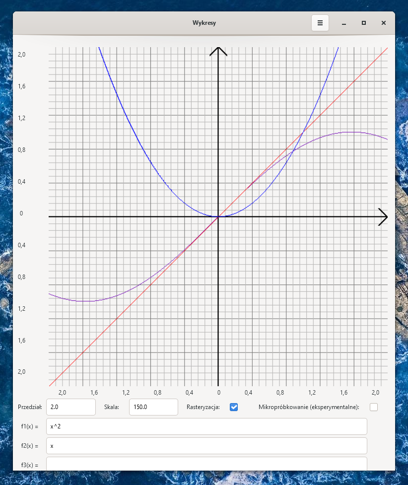

# Wykresy w C

## Opis programu

Program wykresy służy do rysowania wykresów jednej zmiennej w zadanym przedziale. Wykres rysuje się w górnej części programu po naciśnięciu przycisku wprowadź. Program posiada zaawansowany interpreter obsługujący operatory matematyczne, funkcje takie jak sinus czy logarytm, kolejność wykonywania działań, dowolną ilość nawiasów oraz stałe matematyczne. Moduł wyświetlający wykres na ekranie ma zaimplementowany system prostej rasteryzacji, dzięki czemu nawet wykresy skomplikowanych funkcji prezentują się w przystępny sposób. Wspierane systemy operacyjne to Windows 10 i Linux.

### Technologie

Technologie użyte do stworzenia programu to:

1. Język C11 (GCC 10.2),
2. Biblioteka GTK 4.0,
3. Program make,
4. Visual Studio Code.

## Kompilacja ze źródła i uruchamianie

### Windows

1. pobrać i zainstalować [MSYS2](https://www.msys2.org/), zgodnie z zaleceniami ze strony
2. pobrać i zainstalować bibliotekę [GTK](https://www.gtk.org/docs/installations/windows/) (GTK 4.0) zgodnie z instruckją na stronie
3. jeżeli nie są zainstalowne, przez menedżer pakietów MSYS2 pobrać kompilator mingw i program make;
4. poprzez konsolę MSYS2 MinGW 64-bit (lub 32-bit) odnaleźć folder z kodem źródłowym i wpisać polecenie 'make';
5. uruchomić program poleceniem ./wykresy.exe.

### Linux

1. poprzez wbudowany w dystrybucje menedżer pakietów pobrać i zainstalować pakiet 'libgtk-3-dev' wraz z pakietmai zależnymi;
2. jeżeli nie są zainstalowane, przez wbudowany w dytrybucje menedżer pakietów pobrać kompilator gcc i program make;
3. w pliku types.h w 4 linijce zmienić '#define WINDOWS' na '#define LINUX';
4. w terminalu odnaleźć folder z kodem źródłowym i wpisać polecenie 'make';
5. uruchomić program poleceniem ./wykresy.

## Równania matematyczne

W tej sekcji opiszę jakie możliwości daje intepreter poleceń matematycznych wbudowany w program i jak konstruować zapytania. W programie można wpisać na raz 4 równania, które będą wyświetlane jednocześnie na wykresie.

Wykresy mają różne kolory, odpowiednio niebieski, czerwony, zielony i fioletowy.

### Składnia

#### Liczba

Liczba to stała zapisana za pomocą cyfr oraz kropki i przecinka ({0, 1, 2, 3, 4, 5, 6, 7, 8, 9, 0,, ,.}). Liczby to np. 10, 2,5, 10.5, 0, 11, 123, itd.

Przed liczbą może znajodwać się '+' lub '-' oznaczający znak liczby, np: +10, -0.5.

#### Funkcje

Funkcje składają się z nazwy, nawiasów okrągłych oraz przyjmują jeden argument. Np.: sin(wyrażenie), log(wyrażenie), itd.

W programie dostępne są następujące funkcje:

- sin(x)
- cos(x)
- tan(x) - inna forma: tg(x)
- cot(x) - inna forma: ctg(x)
- ln(x) - logarym naturalny, również log(x)
- log2(x) - logarytm dwójkowy
- log10(x) - logarytm dziesiątkowy
- sqrt(x) - pierwiastek kwadratowy
- abs(x) - wartość bezwzględna
- sinh(x) - sinus hiperboliczny
- cosh(x) - cosinus hiperboliczny
- tanh(x) - tangens hiperboliczny, również tgh(x)
- floor(x) - część całkowita, tak zwana podłoga
- ceil(x) - część całkowita (zaokrąglenie w górę), tak zwany sufit
- asin(x) - arcus sinus, również arcsin(x)
- acos(x) - arcus cosinus, również arccos(x)
- atan(x) - arcus tangens, również arctan(x) i arctg(x)
- exp(x) - funkcja ekspotencjalna

#### Stałe

W programie zdefiniowane są 3 specjalne stałe, można je wpisywać tak samo jak liczby:

- e
- pi
- phi

#### Zmienna

Jako, że program rysuje funkcje jednej zmiennej, to dostepna jest tylko jedna zmienna - 'x'. Intepreter pod zmienną x podstawia odpowiednią wartość liczbową, w zależności od części wykresu, która jest rysowana.

Uwaga! Użycie innej litery niż x jako zmiennej nie zadziała!

#### Nawiasy

Dostepne są 4 rodzaje nawiasów:

- Nawiasy okrągłe '()' - zwykłe nawiasy bez specjalnych funkcji, wyrażenie w tych nawiasach wykonywane jest w pierwszej kolejności. Dzięki nim można wpływać na kolejność wykonywania działań.
- Nawiasy typu '||' - posiadają funkcje nawiasów okrągłych, a dodatkowo obliczają wartość bezwzględną. Równoważne byłoby użycie funkcji abs(wyrażenie).
- Nawiasy kwadratowe '[]' - oprócz tego, że wyrażenie w nawiasach wykonywane jest w pierwszej kolejności, to zwaracana jest część całkowita tego wyrażenia. Równoważne byłoby użycie funkcji floor(wyrażenie).
- Nawiasy klamrowe '{}' - wyrażenie w nawiasach wykonywane jest w pierwszej kolejności i zwracana jest część ułamkowa wyrażenia.

#### Operatory binarne

W programie jest 5 operatorów binarnych, przyjmujących dwa argumenty, jeden z prawej, drugi z lewej strony operatory.

Dostepne operatory:

- x+y - dodawanie
- x-y - odejmowanie
- x*y - mnożenie
- x/y - dzielenie
- x^y - potęgowanie

Operatory mają różne priorytety. Najpierw wykonywane jest potęgowanie, potem mnożenie i dzielenie, a na końcu dodawanie i odejmowanie.

Jeżeli operatory mają ten sam priorytet wykonywane są od lewej do prawej, wyjątkiem jest potęgowanie, które wykonuje się w drugą stronę.

Czasem niewymagane jest pisanie znaku mnożenia. Np. '2x' intepretowane jest jako '2 * x'.

Jako x i y można podstawić zmienną, stałe, liczby, wyrażenie w nawiasach lub funkcje.

### Semantyka

Poprawne wyrażenia matematyczne w programie:

- Każda liczba, stała i zmienna jest poprawnym wyrażeniem
- (wyrażenie) (op) (wyrażenie) jest poprawnym wyrażeniem, gdzie (op) to '+', '-', '*', '/' lub '^'
- nazwafunkcji((wyrażenie)) jest poprawnym wyrażeniem
- ((wyrażenie)) jest poprawnym wyrażeniem (gdzie '()' to dowolne nawiasy)

Wszystkie wyrażenia matematyczne można skonstruować według powyższej zasady.

W zapytaniach można używać dowolnej liczby spacji lub nie używać jej wcale, wyjątkiem są spacje wewnątrz liczby, nazwy funkcji lub stałej, które są niedozwolone.

## Ustawienia

W programie znajduje się kilka ustawień, którymi można zarządzać jak funkcje mają być wyświetlane na wykresie.

### Przedział

Pole tekstowe przedział przyjmuje jedną liczbę (może być to liczba całkowita lub liczba ze skończonym rozwinięciem dziesiętnym). Po wpisaniu 10.0 funkcja będzie rysowana na przedziale od -10 do 10.

### Skala

Pole tekstowe skala przyjmuje jedną liczbę (może być to liczba całkowita lub liczba ze skończonym rozwinięciem dziesiętnym). Skala odpowiada za przeciwdziedzinę na jakiej rysowana będzie funkcja. Przy skali 1.0 najmniejsza wartość jaką można zobaczyć to f(x) = -300, a nazjwiększa +300, przy skali 2.0 przedział to (-150, 150), przy domyślnej skali 30.0 przedział to (-10, 10).

### Rasteryzacja i Mikropróbkowanie

Rasteryzacja odpowiada za łączenie kropek na wykresie, tak żeby wyświetlany wykres był ciągłą linią. Opcja ta zalecana jest gdy wykres szybko rośnie lub maleje, bez rasteryzacji ciężko byłoby zaobserwować przebieg funkcji.
Uwaga! Rasteryzacja w punktach nieciągłości może zachowywać się nieprzewidywalnie, np. dla wyrażenia 'floor(x)' funkcjonalność będzie rysowała pionowe linie w punktach f(k), gdzie k jest liczbą całkowitą, co nie powinno mieć miejsca.
Rasteryzacja ma mały wpływ na wydajność i jest włączona domyślnie.

Mikropróbkowanie działa tylko przy włączonej rasteryzacji. Funkcjonalność wykonuje dodatkowe testy w punktach nieciągłości i decyduje czy rysować linie łączącą kropki czy nie. Funkcjonalność jest eksperymentalna, ale powinna lepiej odzwierciedlać wykresy skomplikowanych funkcji.
Mikropróbkowanie ma duży wpływ na wydajność i jest domyślnie wyłączone.

## Przewodnik po kodzie programu

W programie znajdują się następujące moduły

- Intepreter poleceń matematycznych w plikach eval.h i eval.c,
- Moduł wyświetlający wykres w plikach draw.h i draw.c,
- Moduł rysujący interfejs w plikach main.h i main.c,
- Używane struktury zdefiniowane są w pliku types.h.

Wyjaśnienie działania poszczególnych funkcji jest wyjaśnione w komentarzach wewnątrz programu.

## Dalszy rozwój

Po zakończeniu projektu planuję dalsze prace nad programem. Oprócz rozwoju samego kodu, gdzie planuję wykorzystywanie CSS przy rysowaniu interfejsu, zaplanowane są również następujące funkcjonalności:

- Wsparcie dla funkcji o kilku arguemntach, np. logarytm dowolnej podstawy;
- Rysowanie wykresu pochodnej;
- Zapisywanie wykresu do pliku .bmp;
- Zapis i odczyt funkcji z pliku tekstowego;
- Parametry uruchamiania programu z konsoli;
- Menu ustawień i "Co nowego";
- Konfiguracja własnych stałych matematycznych;
- Moduł automatycznych aktualizacji;
- Ciemny motyw.

## Licencjonowanie

Program wykresy będzie darmowym oprogramowaniem open-source na licencji [MIT](./LICENSE). Po oddaniu projektu kod zostanie otwarty i będzie dostepny w publicznym repozytorium na GitHubie.
